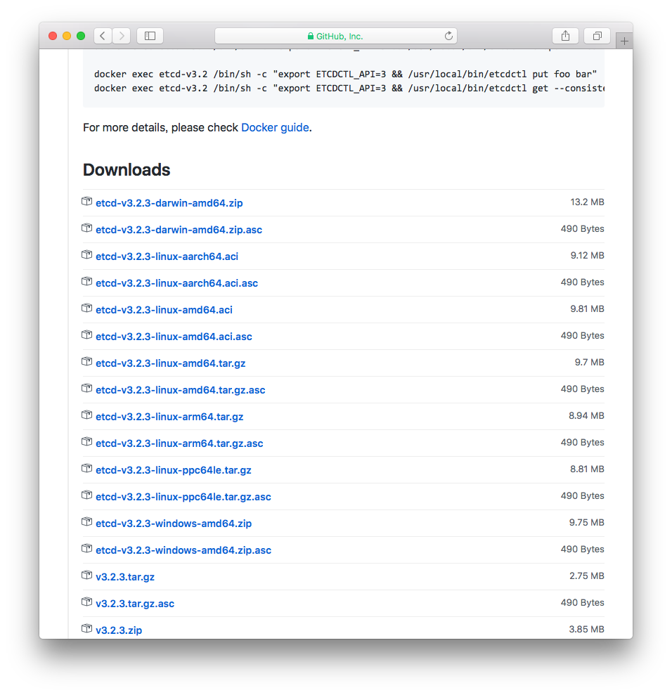
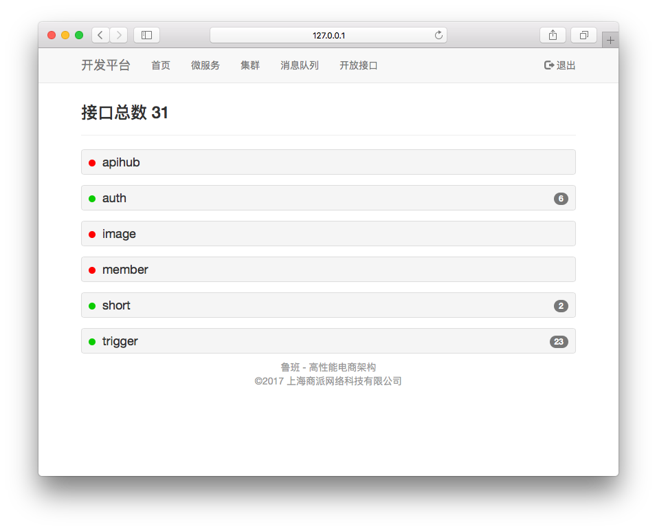

# 快速开始

## 安装etcd.

### Mac

安装etcd.

```
brew install etcd
```

启动etcd
```
etcd
```

etcd已经启动在你的2379端口.

结束了, 作为开发环境足够了 :) .


### Windows
下载 [etcd-v3.2.3-windows-amd64.zip](https://github.com/coreos/etcd/releases/download/v3.2.3/etcd-v3.2.3-windows-amd64.zip)
解包,  执行.

### 其他
可以到<https://github.com/coreos/etcd/releases/> 去查看所有版本以及预编译好的包.



etcd启动好后即可进行下一步.

## SERVER: 体验demo服务

我们预先写好了一个helloworld服务, 下载地址 <https://github.com/shopex/luban-srv-hello/releases/tag/1.0>

请根据你的操作系统直接下载对应的编译好的包.  如果你想编写自己的服务, 看[这个文档](04.mkserv/01.golang.md).

## CLIENT: 安装devops web界面, 查看并调用接口

使用 https://github.com/shopex/luban-devops 项目, 就能查看并调用服务了.

```
git clone https://github.com/shopex/luban-devops
cd luban-devops
npm install
npm run production
composer update
php artisan serve --port 8010
```

访问``http://127.0.0.1:8010/``, 即可看到接口列表了.



## 创建应用

接下来, 你可以了解到如何调用接口, 从而[编写自己的应用](03.apps/01.php.md).